# F5 Edge Compute for Multicloud Apps

# Table of Contents

- [F5 Edge Compute for Multicloud Apps](#f5-edge-compute-for-multicloud-apps)
- [Table of Contents](#table-of-contents)
- [Objective](#objective)
- [Resources](#resources)
- [Scenario](#scenario)
- [Use-cases and Module Overview](#use-cases-and-module-overview)
- [Pre-Requisites](#pre-requisites)
  - [Create mK8s resource](#create-mk8s-resource)
  - [Create app stack](#create-app-stack)
  - [Get mK8s Kubeconfig](#get-mk8s-kubeconfig)
  - [Create AWS CE site](#create-aws-ce-site)
- [MODULE 1](#module-1)
  - [Deploy kiosk](#deploy-kiosk)
  - [Create branch-a namespace](#create-branch-a-namespace)
  - [Create HTTP LB for kiosk](#create-http-lb-for-kiosk)
  - [Test kiosk](#test-kiosk)
  - [HTTP LB recommendations module](#http-lb-recommendations-module)
  - [Test recommendations module](#test-recommendations-module)
- [MODULE 2](#module-2)
  - [Create buytime-online namespace](#create-buytime-online-namespace)
  - [Create buytime-ce-sites virtual site](#create-buytime-ce-sites-virtual-site)
  - [Create virtual K8s](#create-virtual-k8s)
  - [Deploy synchronization module to vK8s](#deploy-synchronization-module-to-vk8s)
  - [Create TCP LB for synchronization module](#create-tcp-lb-for-synchronization-module)
  - [Test synchronization module](#test-synchronization-module)
- [MODULE 3](#module-3)
  - [Deploy online store module to vK8s](#deploy-online-store-module-to-vk8s)
  - [Create HTTP LB for online store](#create-http-lb-for-online-store)
  - [Create virtual RE site](#create-virtual-re-site)
  - [Assign RE and CE sites to vK8s](#assign-re-and-ce-sites-to-vk8s)
  - [Deploy deals module to vK8s](#deploy-deals-module-to-vk8s)
  - [Create HTTP LB for lightning deals](#create-http-lb-for-lightning-deals)
  - [Test Lightning deals module](#test-lightning-deals-module)
- [Wrap-Up](#wrap-up)

# Objective

This guide, along with the provided scripts and sample app & services, is designed to help explore and demonstrate the capabilities of the F5 Distributed Cloud Platform through the lens of the key strategic solution area - **Hybrid Multicloud App Delivery** for seamlessly deploying app components across cloud, branch, and edge.

The outlined use-cases focus on F5 Distributed Cloud App Stack, Multi-Cloud Networking (MCN) and Edge Compute services.

You can use the included scripts to deploy a WooCommerce sample app, which represents a traditional 3-tier app architecture (backend + database + frontend). With F5 Distributed Cloud Services, you can easily deploy and securely network these app services to create a distributed app model that spans across:

- Customer Edge (CE) public cloud

- Retail Branch (App Stack on a private cloud)

- Regional Edge (RE)

The guide walks through the key use-cases for this distributed app architecture via several modules, all based on the following scenario.

# Resources

For more information on the use cases covered by this Demo Guide, please see the following resources including DevCentral article(s), YouTube video(s), different versions of this guide specific to Amazon AWS and Microsoft Azure deployment, and automation scripts based on Terraform:

- [DevCentral Summary Article outlining Edge Compute with F5 Distributed Cloud Services](https://community.f5.com/t5/technical-articles/demo-guide-edge-compute-with-f5-distributed-cloud-services-saas/ta-p/316764)

- [YouTube video series giving Edge Compute use case examples](https://www.youtube.com/watch?v=pmh_2oz_5Ys)

- Cloud-Specific Demo Guides: Azure or AWS (1 cloud provider only)

| **SaaS Console**                                                                                | **Terraform Automation**                                                                                         |
| ----------------------------------------------------------------------------------------------- | ---------------------------------------------------------------------------------------------------------------- |
| [Edge Compute (AWS only) via SaaS Console](https://github.com/f5devcentral/xcawsedgedemoguide)  | [Edge Compute (AWS only) via Terraform](https://github.com/f5devcentral/xcawsedgedemoguide/tree/main/terraform)  |
| [Edge Compute (Azure only) via SaaS Console](https://github.com/f5devcentral/xcazedgedemoguide) | [Edge Compute (Azure only) via Terraform](https://github.com/f5devcentral/xcazedgedemoguide/tree/main/terraform) |

# Scenario

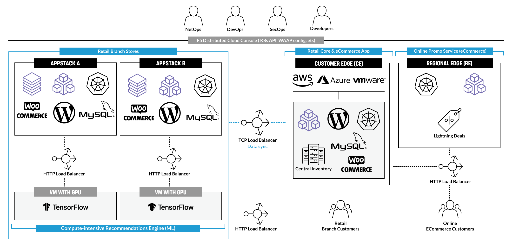

The BuyTime Online & Retail scenario is a representative example of a shared Retail Branch + Online eCommerce architecture, where a traditional 3-tier app built on WooCommerce (powered by WordPress + MySQL) is used in both deployment models:

- The Retail Branch Kiosk provides recommendations and processes orders for in-store shoppers. The key requirements for this scenario are ease of deployment and configuration of the Retail Branch Kiosks, as well as the ability to quickly and securely connect to other services, including the recommendation engine service that runs in each branch and the central inventory database that runs in the public cloud.
- The Online .com site provides typical eCommerce capabilities and is augmented with modern online promotion features. The key requirements are a quick response time for time- and latency-sensitive online promotions, similar to Amazon’s Lighting Deals, as well as high security for both in-branch and online eCommerce operations.

For simplicity, this scenario re-uses the standard WooCommerce datasets for a clothes shop. The modules below lay out a framework for connecting and managing F5 Distributed Cloud Services for this scenario, with a focus on the three core use-cases.

# Use-cases and Module Overview

Distributed Cloud Services enable a consistent deployment, management, and security model for applications across hybrid and multicloud environments. In this scenario, a fictitious retailer named BuyTime will use F5 Distributed Cloud App Stack to create a consistent deployment topology for an in-store Kiosk shopping experience by utilizing a traditional 3-tier app stack: WooCommerce frontend + backend & MariaDB. This topology can run in multiple Retail Branches with identical configuration, management, and security policies applied.

The following three use-cases are the key components of this guide and are represented in each of the modules:

**MODULE 1**

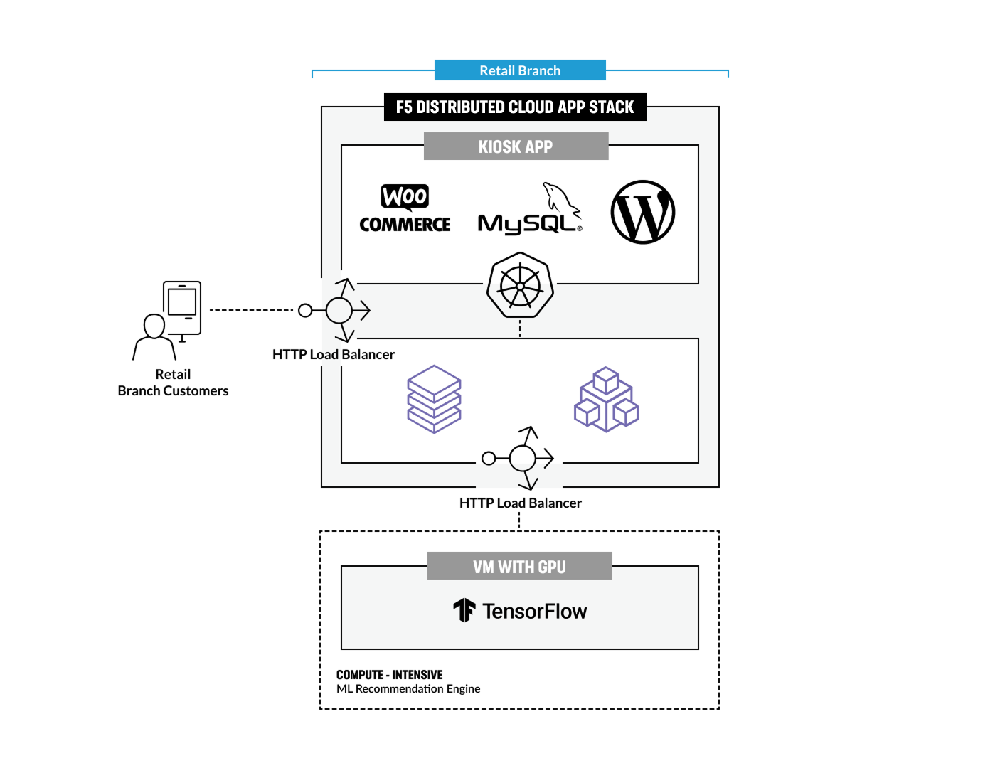

The HTTP Load Balancer can be utilized to securely connect Retail Branches running in-store Kiosks on Distributed Cloud App Stack (Compute @ Edge) to a VM hosting the shopping recommendation service. Each of these Kiosks can leverage the App Mesh and Multi-Cloud Networking features built into App Stack to securely connect to internal and external services.
The BuyTime Retail Kiosk uses an external recommendation engine, which simulates a common use-case for a Machine Learning (ML) service that can be deployed on a VM with a GPU (Recommendation ML Service for compute-intensive tasks on VM w/ GPU). This engine processes images of clothes or accessories uploaded from the Kiosk and makes recommendations for other matching clothes/accessories.
To simplify the scenario for this demo, the sample app uses a mock service that returns an image based on specified criteria instead of using TensorFlow or a similar platform. We also provide a link to the recommendation service deployed in our cloud, so there is no need to run a VM in your network. However, we have included the scripts to run the Docker on your VM if you would like to deploy and use your own.

**MODULE 2**

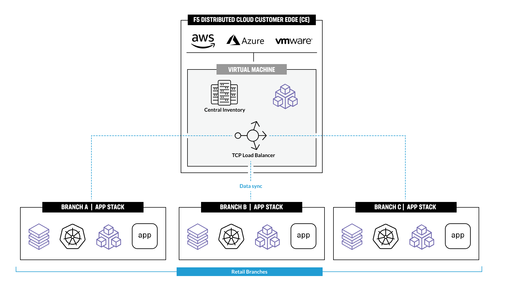

In module two, we focus on configuring Multi-Cloud Networking for the BuyTime App. The TCP Load Balancer is utilized to securely connect and synchronize branch databases with the central inventory and order databases deployed in the public cloud on the Customer Edge (CE).

It's worth noting that the TCP Load Balancer operates on Layer 4 of the OSI model, which is the Transport Layer. It forwards traffic to backend servers based on the source IP address and port and destination IP address and port, making it an ideal choice for load balancing TCP traffic.

By using the TCP Load Balancer, you can ensure that the inventory and order data is always up-to-date and accurate while providing secure networking between the central database in the CE and the Retail branch.

**MODULE 3**

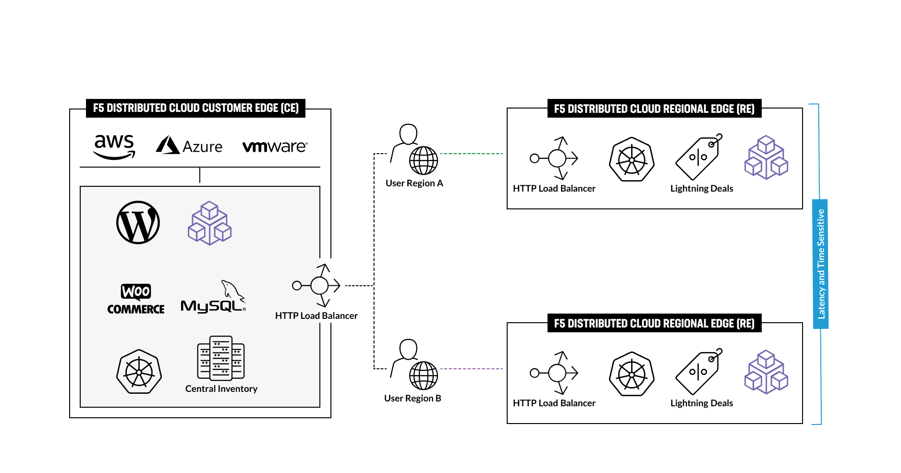

In this scenario, the Regional Edge is used with an HTTP Load Balancer to enhance eCommerce capabilities with time- and latency-sensitive promotional capabilities. This can be achieved by deploying a slightly modified version of the WooCommerce app with a different theme and modules.

Similarly, the same WooCommerce app can also be deployed, connected, and secured on the Customer Edge (CE) in a public or private cloud. By making some minor changes to the theme and modules, the app can be used to drive an eCommerce site with a set of time-limited, low-latency online promotional services similar to Amazon's Lightning Deals.

# Pre-Requisites

## Create mK8s resource

First of all, we will need to create a managed Kubernetes (mK8s) cluster. To do that, log into the F5 Distributed Cloud Console and navigate to the **Distributed Apps** service.

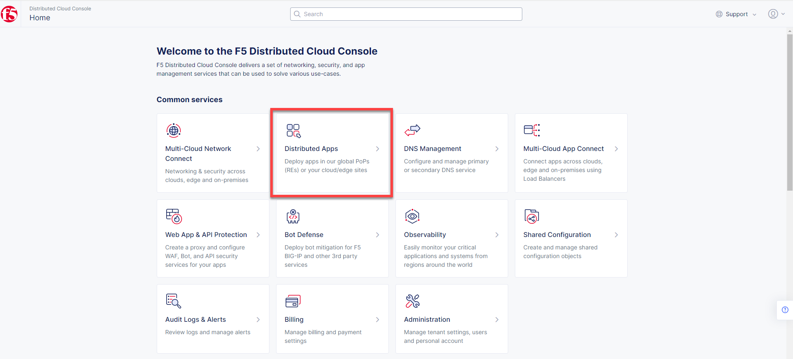

Select the **system** Namespace. In the left-side navigation panel proceed to the **Manage** section, click **Manage K8s** and select **K8s Clusters**. When the page opens, click the **Add K8s Cluster** button.

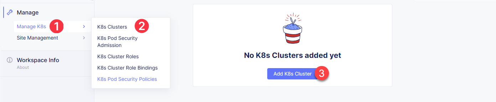

In the opened creation form, enter a name for the K8s cluster.

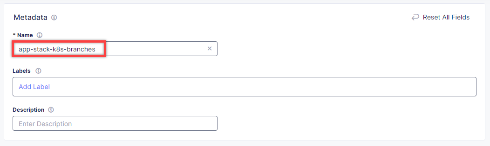

In the **Access** section, select the **Enable Site Local API Access** option from the **Site Local Access** menu. This enables local access to K8s cluster.
Then in the **Local Domain** field, enter a local domain name for the K8s cluster in the <code>sitename.localdomain</code> format. We will use the **buytime.internal** for this demo. The local K8s API server will become accessible via this domain name.
Next, from the **Port for K8s API Server** menu, select **Default k8s Port** which uses default port 65443.
From the **VoltConsole Access** menu, select the **Enable VoltConsole API Access** option which will let us download the global kubeconfig for the managed K8s cluster.

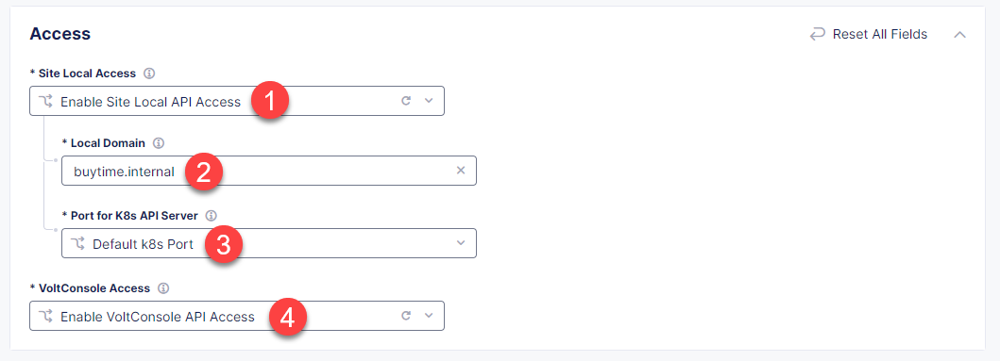

Finally, complete creating the K8s cluster by clicking **Add K8s Cluster**.

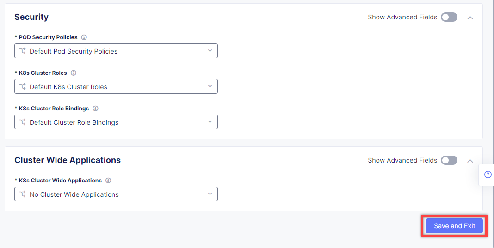

## Create app stack

Let's start with creating an Azure VNet Site and then move on to creating an app stack. Proceed to the **Multi-Cloud Network Connect** service, then navigate to the **Site Management** section and select **Azure VNET Sites**. Click the **Add Azure VNET Site** button.

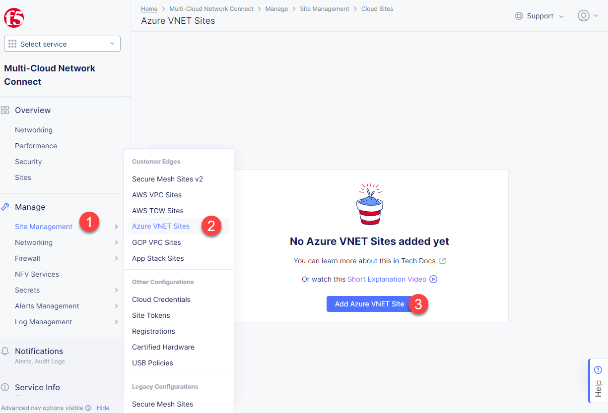

In the **Metadata** section, give the site a name and specify a label. Type in **location** for the custom key and **buytime-app-stack** for its value.

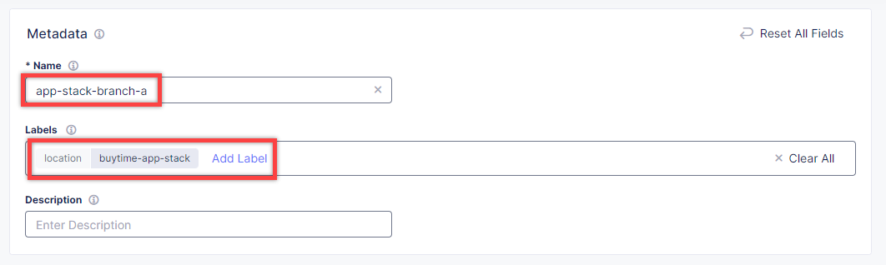

Next, we will configure site type. First, select your cloud credentials. Then enter your Azure resource group **app-stack-branch-a** for resources that will be created. Ensure that you enter a name for a non-existent resource group. With the **Recommended Azure Region Name** option selected by default, go on and select **centralus** for this demo.
For a new Vnet choose **Autogenerate Vnet Name** and enter the **10.125.0.0/16** CIDR in the IPv4 CIDR block field.

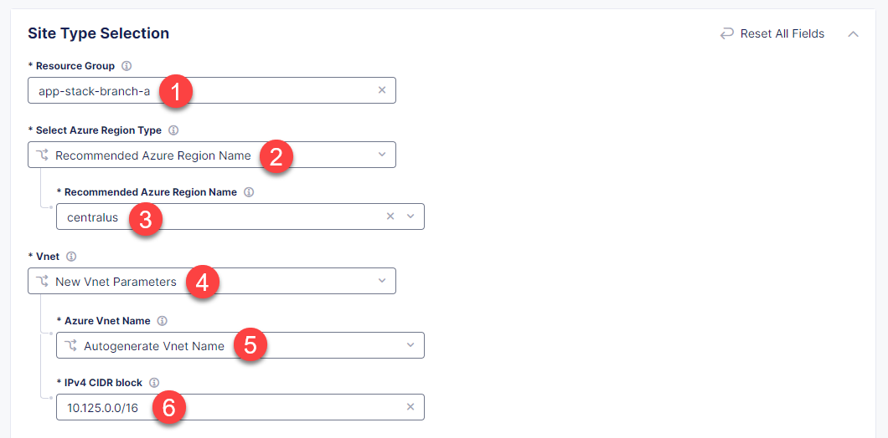

In this step, we will create an app stack cluster. Open the **Select Ingress Gateway or Ingress/Egress Gateway** menu, and select **App Stack Cluster (One Interface) on Recommended Region**. It will use single interface and be used for deploying K8s cluster.

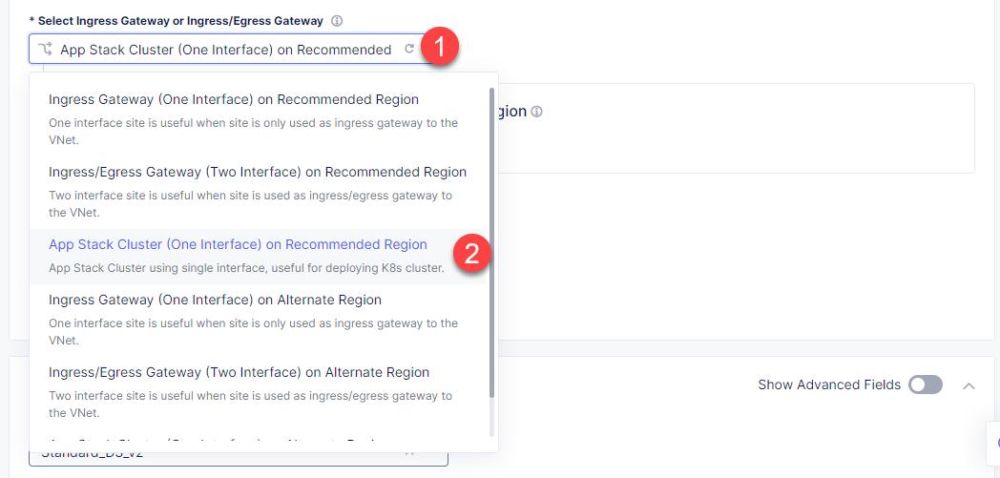

Click **Configure** to move on to the configuration.

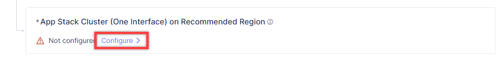

Then click **Add Item** to configure an app stack cluster (one interface) node.

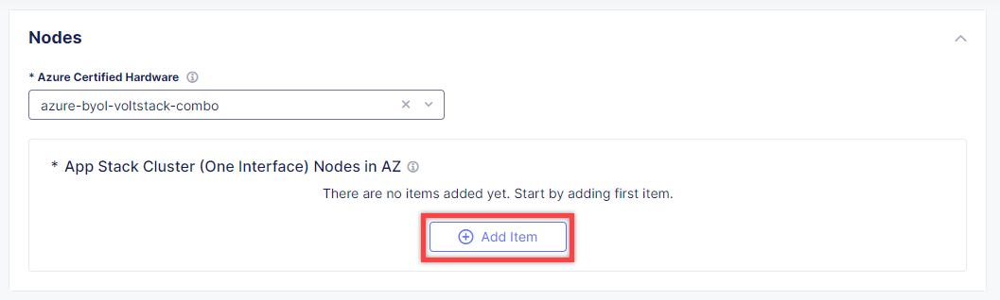

From the **Azure AZ name** menu, select **1** to set the number of availability zones.
After that, open the **Subnet for local interface** menu to select **New Subnet** and add parameters for creating a new subnet. Enter the subnet address **10.125.10.0/24** in the IPv4 Subnet field for the new subnet. Finally, click the **Apply** button.

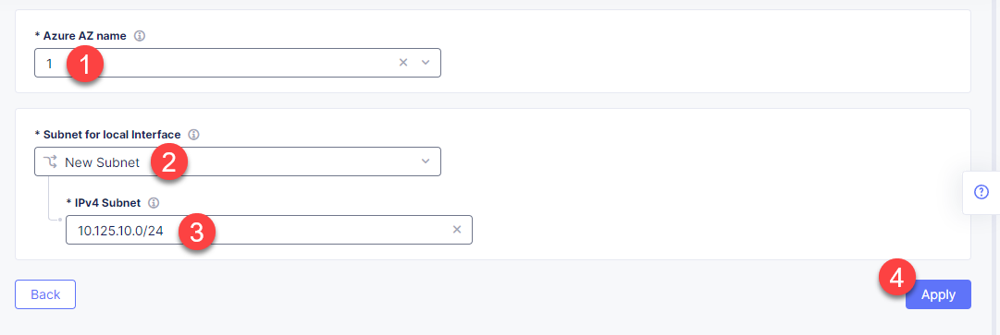

In the **Advanced Options** section, enable **Site Local K8s API access** and select the **system/app-stack-k8s-branches** K8s cluster object we created earlier. Then click the **Apply** button.

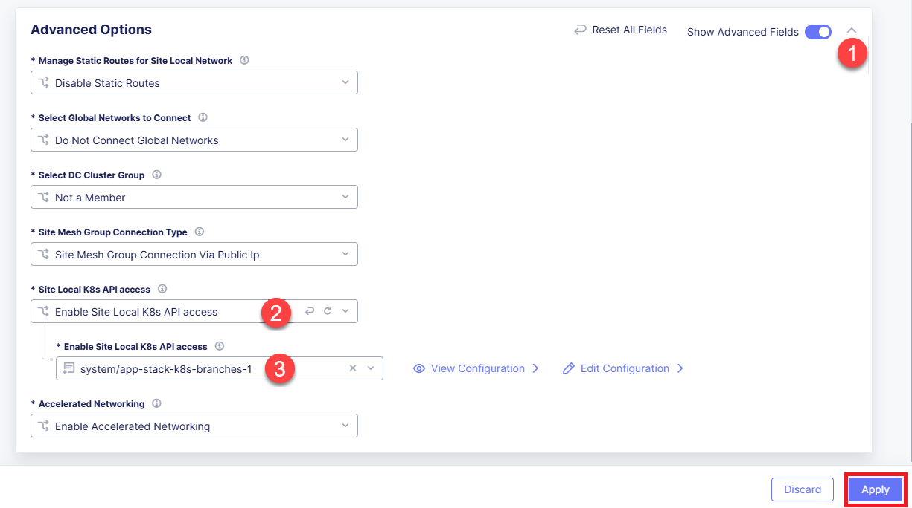

Proceed to the **Site Node Parameters** section and make sure the **Standard_D3_v2** Azure machine type is set. Then go down to the **Public SSH key** and paste the key to access the site. Note that if you don't have a key, you can generate one using the "ssh-keygen" command and then display it with the command "cat ~/.ssh/id_rsa.pub".

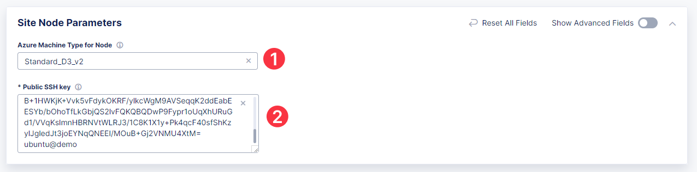

Then scroll down to the **Advanced Configuration** section to configure services to be blocked on site. Select the **Custom Blocked Services Configuration** in the drop-down menu and then click **Add Item**.

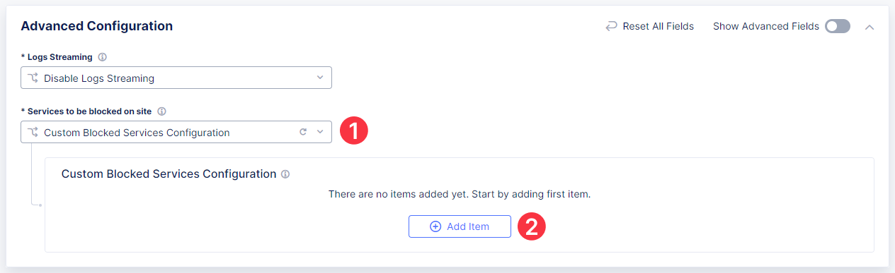

First, make sure that Node Local Service is **SSH**, then select **Site Local Network** as Site Local VRF. Finally, click **Apply**.

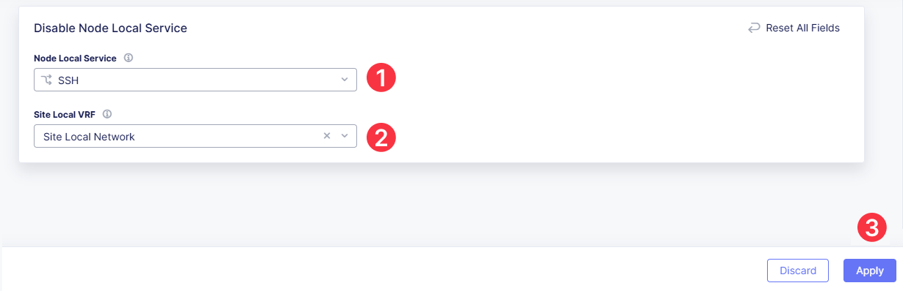

After that, take one more look at the configuration and complete it by clicking the **Add Azure VNET Site** button.

The Status box for the VNet object will display **Generated**. Click **Apply** in the Actions column. The Status field for your Azure VNet object changes to Applying.

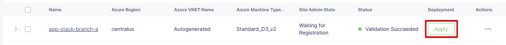

Wait for the apply process to complete and the status to change to **Applied**.

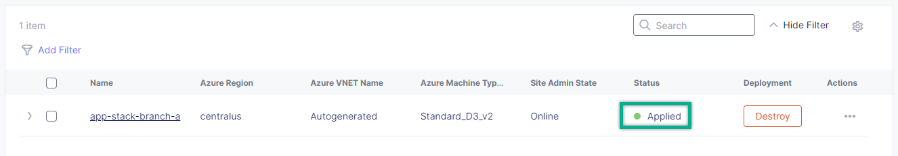

## Get mK8s Kubeconfig

Next, we will get the mK8s Kubeconfig. Navigate to the **Managed K8s** section of the **Distributed Apps** service and proceed to **Overview**. The page will show the created managed K8s. Open its menu and select **Download Global Kubeconfig**.

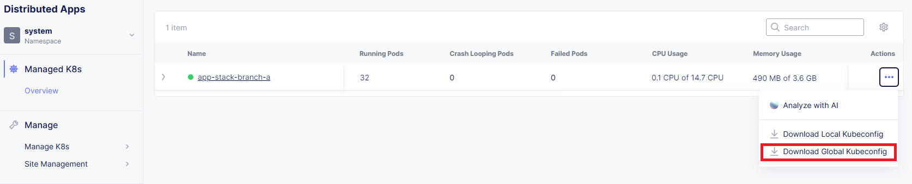

Open the calendar, select the expiry date and click the **Download Credential** button.

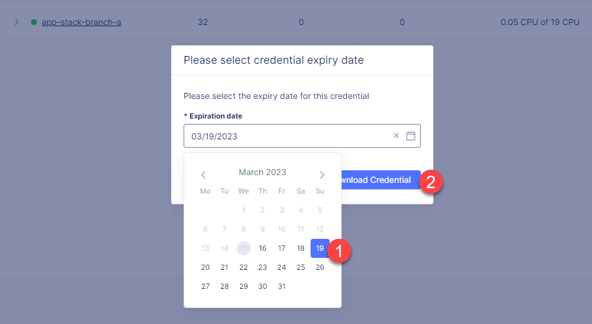

Let's now run the command to see the number of Kubernetes pods deployed to run the application. Proceed to your local CLI and run the command:

    > kubectl --kubeconfig ./your_mk8s_kubeconfig_global.yaml get nodes

    nodes
    NAME            STATUS   ROLES        AGE   VERSION
    master-node-1   Ready    ves-master   20m   v1.23.14-ves

As we can see from the output, there's a **master-node-1** node in our Kubernetes having the 'Ready' status.

## Create AWS CE site

Let's now take the last pre-requisite step - creating an AWS VPC CE Site. Navigate to the **Site Management** section and select **AWS VPC Sites**. Click the **Add AWS VPC Site** button.

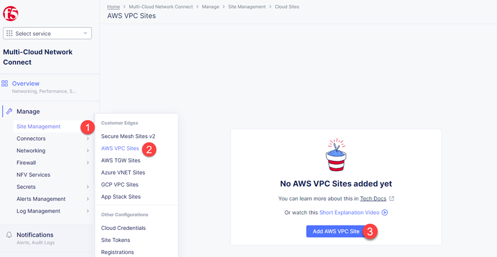

Enter a name and proceed to the labels. Type in **location** for the custom key and **buytime-ce-site** for its value.

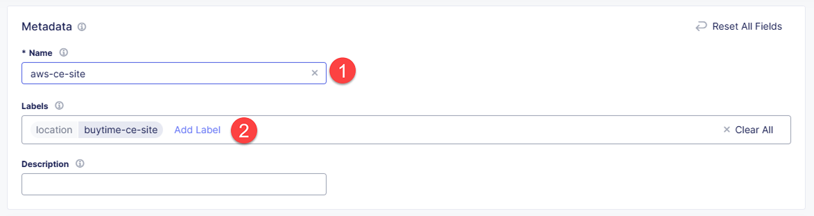

Next, we will configure site type. First, select your cloud credentials. Then pick your AWS Region. Fill in the **172.24.0.0/16** CIDR in the Primary IPv4 CIDR block field. Open the Select Ingress Gateway or Ingress/Egress Gateway menu, and select **Ingress/Egress Gateway (Two Interface)** which is useful when the site is used as ingress/egress gateway to the VPC. Click **Configure** to open the two-interface node configuration.

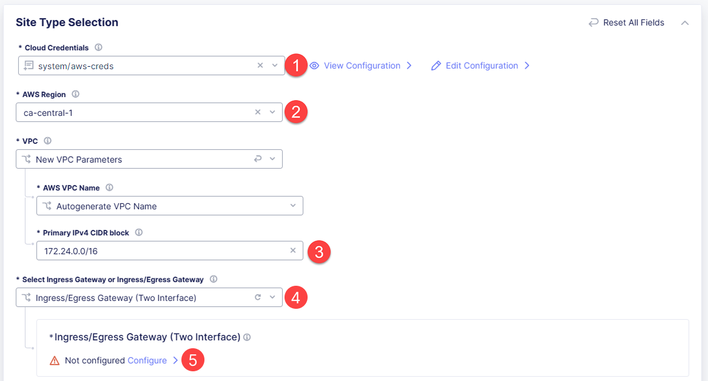

Click **Add Item** to add a node.

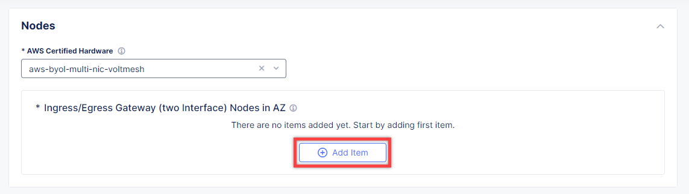

Select the **ca-central-1a** AWS availability zone. Please note that it must be consistent with the AWS Region selected earlier.
For the **New Subnet** selected by default, enter the **172.24.30.0/24** subnet in the IPv4 Subnet field.
Then go on to configure **Subnet for Outside Interface** by entering the **172.24.20.0/24** subnet in the IPv4 Subnet field.
And finally, in the **Subnet for Inside Interface** menu, select **Specify Subnet** to create a new one. Fill in the **172.24.10.0/24** subnet in the IPv4 Subnet field. Complete configuring the node by clicking the **Apply** button.

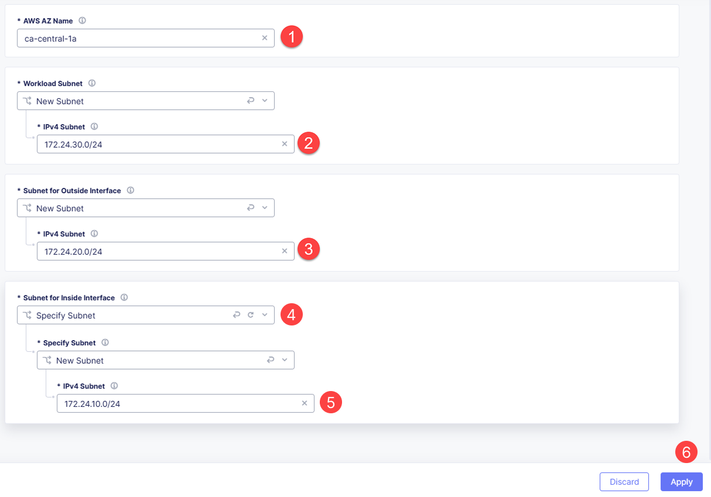

Take a look at the node configuration and click the **Apply** button to proceed.

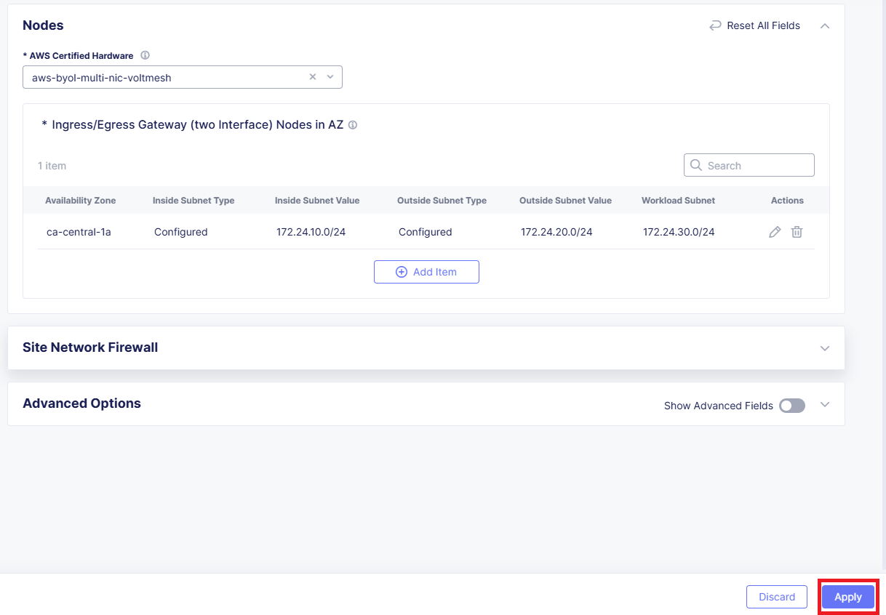

Back on the AWS VPC Site configuration page, we will paste the Public SSH key to access the site. Note that if you don't have a key, you can generate one using the "ssh-keygen" command and then display it with the command "cat ~/.ssh/id_rsa.pub".

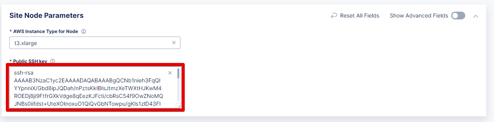

Finally, take one more look at the configuration and complete it by clicking the **Add AWS VPC Site** button.

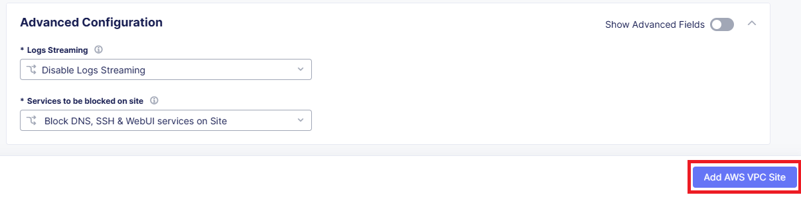

The Status box for the VPC site object will display **Validation Succeeded**. Click **Apply**. The Status field for the AWS VPC object changes to **Applying**. Wait for the apply process to complete and the status to change to **Applied**.

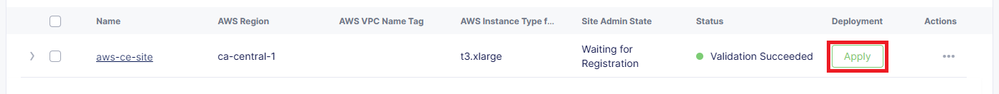

# MODULE 1

In this Module we are going to deploy BuyTime Retail Kiosk using App Stack created within the Pre-requisites section, create an HTTP LB for the Kiosk, and connect the Retail Branches running in-store Kiosk on App Stack to the Recommendation Service using the created HTTP LB.

## Deploy kiosk

In order to deploy the kiosk by running the following command, we will need the Kubeconfig which we downloaded in the [Get mK8s Kubeconfig](#get-mk8s-kubeconfig) section in Pre-requisites. After getting the Kubeconfig, proceed to the CLI and run the following command to deploy the Kiosk:

    > kubectl --kubeconfig ./your_mk8s_kubeconfig_global.yaml apply -f ./deployments/appstack-mk8s-kiosk.yaml

    namespace/branch-a created
    deployment.apps/mysql-deployment created
    service/mysql-service created
    deployment.apps/wordpress-deployment created
    service/wordpress-service created
    deployment.apps/kiosk-deployment created
    service/kiosk-service created

After the command is executed, we can verify the deployment by executing the following command:

    > kubectl --kubeconfig ./your_mk8s_kubeconfig_global.yaml get deployments -n branch-a

    NAME                   READY   UP-TO-DATE   AVAILABLE   AGE
    kiosk-deployment       1/1     1            1           10m
    mysql-deployment       1/1     1            1           10m
    wordpress-deployment   1/1     1            1           10m

If the kiosk is deployed and running correctly, the **1/1** value will appear in the READY column.

## Create branch-a namespace

In order to connect the Retail Branches running in-store Kiosk on App Stack to the Recommendation Service using the HTTP LB, we first need to create a namespace for the HTTP LB. To do that, open the Service menu and navigate to the **Administration** service.

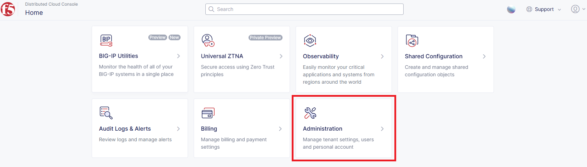

In the **Personal Management** section of the left Administration panel, select **My Namespaces**. Click the **Add Namespace** button. The Add Namespace menu displays.

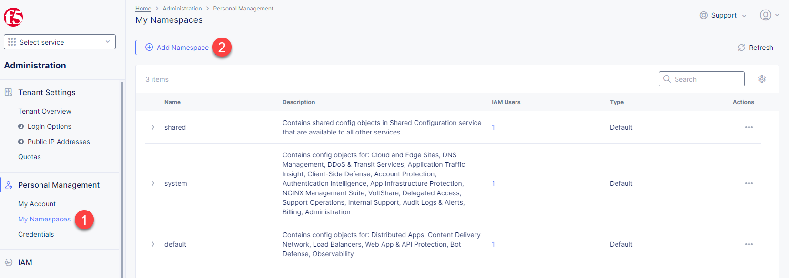

Give namespace a name. Note that each namespace must have a unique name. Click the **Add Namespace** button. The new namespace displays in the list on your My Namespaces page.

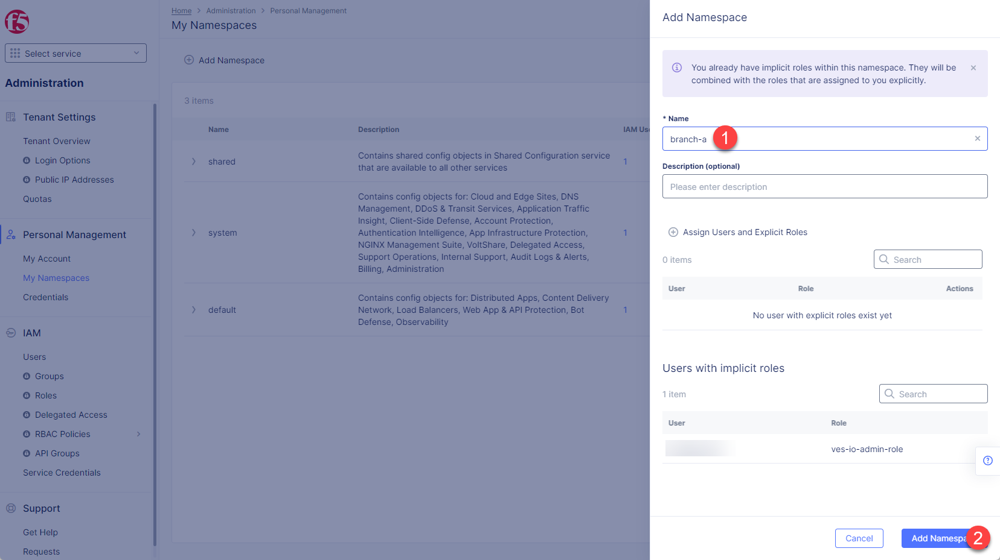

## Create HTTP LB for kiosk

After creating a namespace, we can go on to creating an HTTP LB for the Kiosk in order to connect the Retail Branches running in-store Kiosk on AppStack to the Recommendation Service.
Open the Service menu and navigate to the **Multi-Cloud App Connect** service.

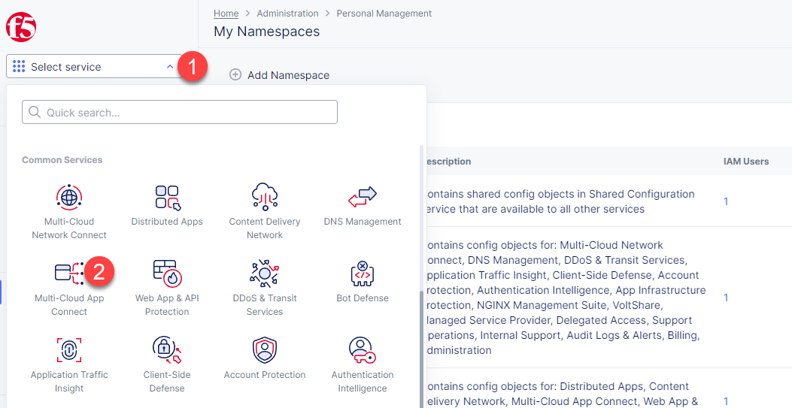

In the **Application Namespaces** menu select the namespace we created in the previous step for the kiosk. Then navigate to the **Load Balancers** section in the left-side panel and select the **HTTP Load Balancers** option. Then click the **Add HTTP Load Balancer** button to open the creation form.

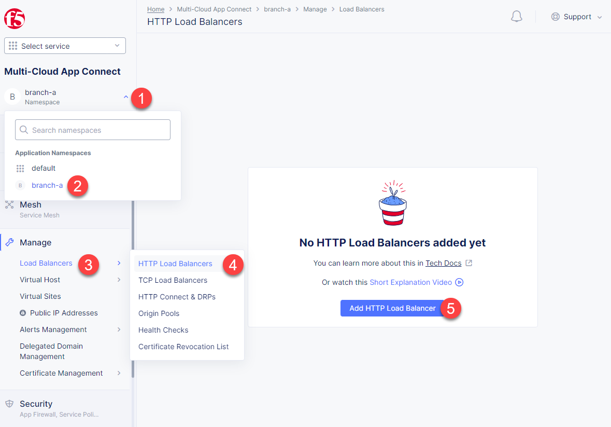

In the **Name** field, enter a name for the new load balancer.

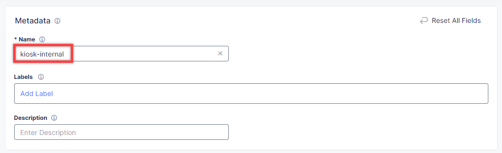

Then proceed to the **Domains and LB Type** section and fill in the **kiosk.branch-a.buytime.internal** domain.
Next, from the **Load Balancer Type** drop-down menu, select **HTTP** to create the HTTP type of load balancer. Make sure port **80** is specified.

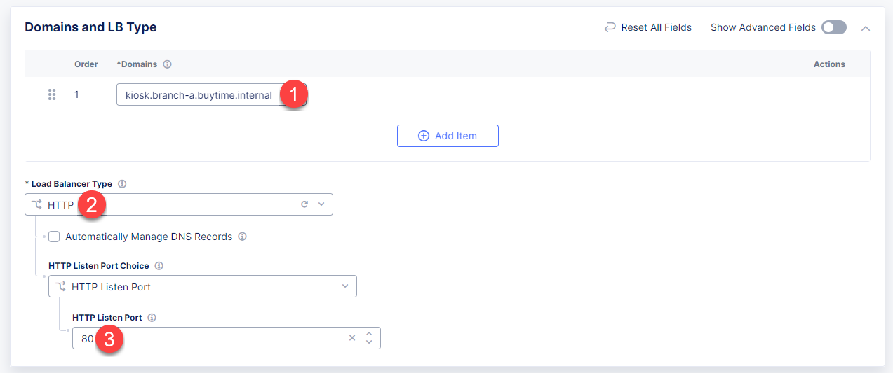

After that move on to the **Origins** section and click **Add Item** to add an origin pool for the HTTP Load Balancer.

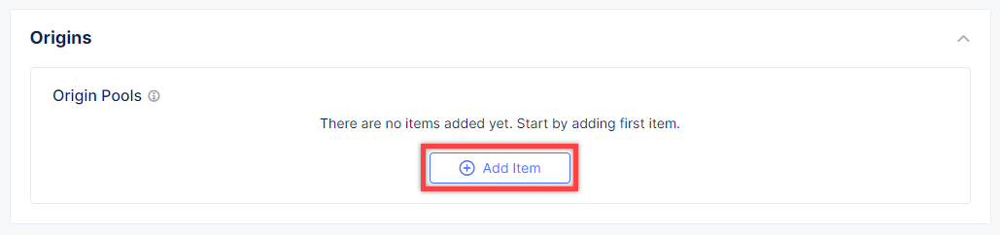

To create a new origin pool, click **Add Item**.

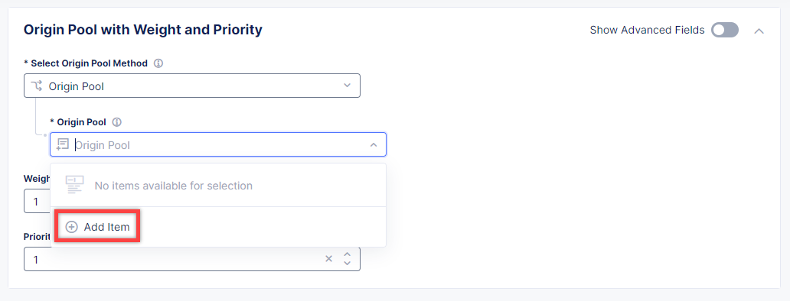

Give origin pool a name.

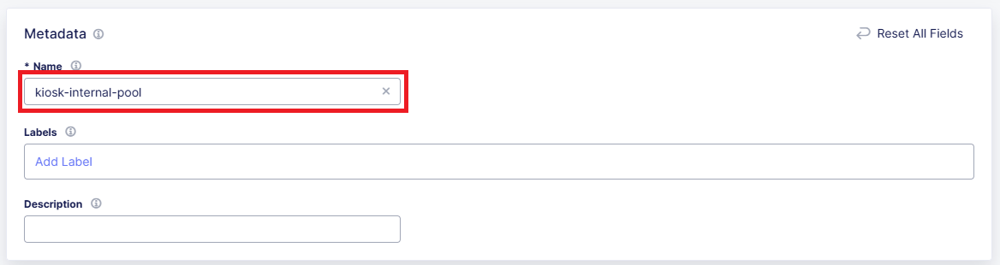

To create a new origin server, click **Add Item**.

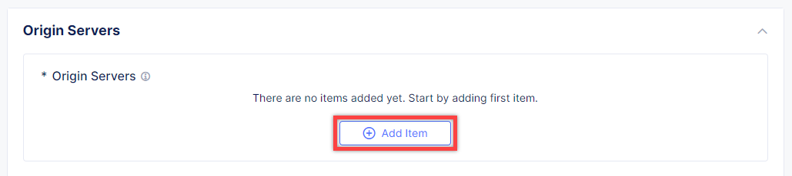

First, from the **Select Type of Origin Server** menu, select **K8s Service Name of Origin Server on given Sites** to specify the origin server with its K8s service name. Then enter the **kiosk-service.branch-a** service name in the Service Name field. Next, select the **system/app-stack-branch-a** site created earlier. After that open the **Select Network on the site** menu and select **vK8s Networks on Site** which means that the origin server is on vK8s network on the site and, finally, click **Apply**.

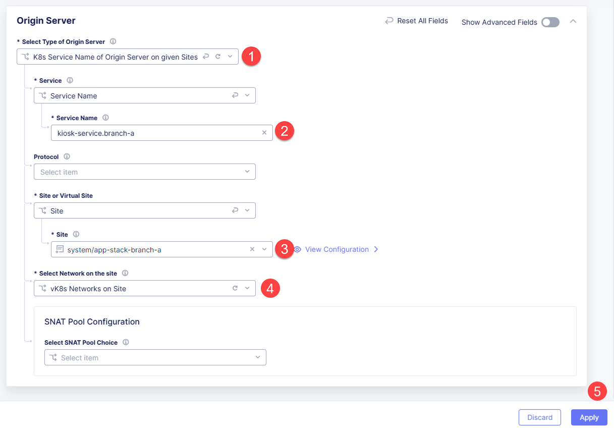

Back on the Origin Pool page, type in the **8080** Origin server Port.

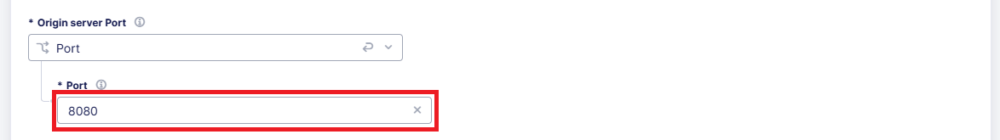

Scroll down and click **Add Origin Pool** to move on to apply the origin pool configuration.

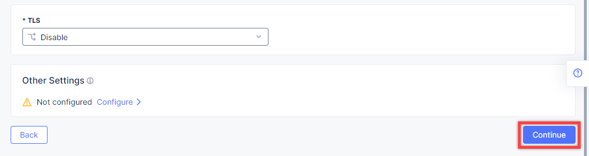

Click the **Apply** button to apply the origin pool configuration to the HTTP Load Balancer.

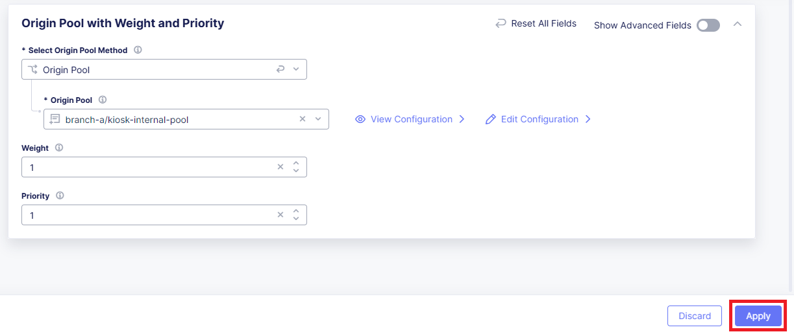

Finally, configure the HTTP Load Balancer to Advertise the VIP to the created site. Select **Custom** for VIP Advertisement, which configures the specific sites where the VIP is advertised. And then click **Configure**.

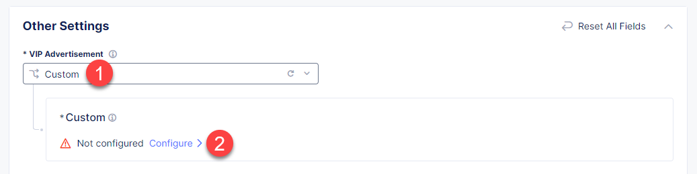

Click **Add Item** to add the configuration.

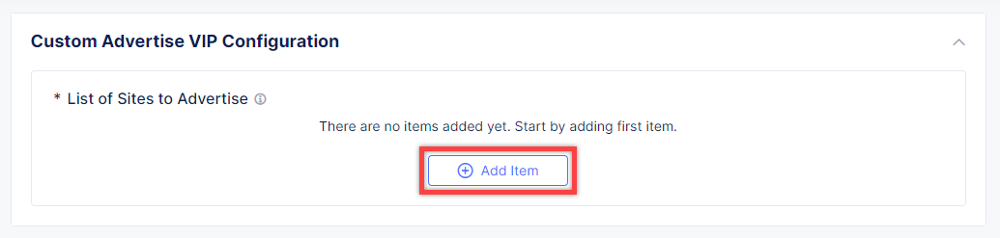

Make sure **Site** is as a place to advertise with **Inside and Outside Network**. Select the created earlier site as site reference. Click **Apply** to add the specified configuration.


Proceed by clicking **Apply**. This will apply the VIP Advertisement configuration to the HTTP Load Balancer.


Complete creating the load balancer by clicking the **Add HTTP Load Balancer** button.


## Test kiosk

Let's now test the kiosk we deployed. To do that create a VM next to your App Stack Deployment like in the image below. This VM will be your kiosk simulation. In the real scenario we assume that kiosk will be a standalone machine which is located or has access to the same network as App Stack.


Here is an example of the networking section that you would encounter when creating a new VM. Select instance region. In this demo we will use **(US) Central US**. And then select the base operating system. We use **Windows Server 2022 Datacenter: Azure Edition Hotpatch - x64 Gen2** for this demo.


Select the subnet.


Find the Private IP of your App Stack VM in Azure. Usually it's 10.125.10.5


Update the DNS server on your Kiosk VM, use the App Stack IP address. In a real scenario, you can use the DNS server on App Stack during network outages when working in offline mode.


Open a browser window on your kiosk VM and proceed to the http://kiosk.branch-a.buytime.internal/ indicated as a domain for kiosk HTTP LB. You can see the kiosk up and running.


## HTTP LB recommendations module

In this part of Module 1 we are going to create an HTTP LB for the recommendation module of our app and then test it.
To do that, go back to the Console and click the **Add HTTP Load Balancer** button to open the creation form.


In the **Name** field, enter a name for the new load balancer expressing its purpose - recommendation.


Then proceed to the **Domains and LB Type** section and fill in the **recommendations.branch-a.buytime.internal** domain. Next, from the **Load Balancer Type** drop-down menu, select **HTTP** to create the HTTP type of load balancer. Make sure port **80** is specified.


After that move on to the **Origins** section and click **Add Item** to add an origin pool for the HTTP Load Balancer.


To create a new origin pool, open the **Origin Pool** menu and click **Add Item**.


Give origin pool a name.


To create a new origin server, click **Add Item**.


First, make sure **Public DNS Name of Origin Server** is selected to specify the origin server with DNS Name. To simplify the guide we provide you with demo server hosted on our cloud. Enter the **recommendations.buytime.sr.f5-cloud-demo.com** DNS name and click **Apply**. If you want to use your own, there is k8s manifest or docker compose file in the **deployments** folder.


Back on the **Origin Pool** page, leave the **443** Origin server Port. Make sure to update the port value in case you use own Recommendations VM deployment.


Scroll down, enable TLS and click **Add Origin Pool** to move on to apply the origin pool configuration.


Click the **Apply** button to apply the origin pool configuration to the HTTP Load Balancer.


Finally, configure the HTTP Load Balancer to Advertise the VIP to the created site. Select **Custom** for VIP Advertisement, which configures the specific sites where the VIP is advertised. And then click **Configure**.


Click **Add Item** to add the configuration.


Make sure **Inside and Outside Network** is specified for the site. Select the created site as site reference. Click **Apply** to add the specified configuration.


Proceed by clicking **Apply**. This will apply the VIP Advertisement configuration to the HTTP Load Balancer.


Complete creating the load balancer by clicking the **Add HTTP Load Balancer** button.


## Test recommendations module

HTTP LB for the recommendation module is created. Now we can test how it works. First, sign in the Kiosk VM created before. Then in the created VM open a browser window and go to the http://kiosk.branch-a.buytime.internal/wp-admin. Log in.


In the Wordpress Admin Dashboard we need to configure the Buytime plugin where we add the link to the recommendations service. Navigate to the **Recommendations** section in the left panel, paste the **recommendations.branch-a.buytime.internal** link and click the **Save Settings** button. If the configuration is successful, you will see the **Connection with the Recommendations server established.** message.


Finally, go to the kiosk http://kiosk.branch-a.buytime.internal to see that the recommendations module is up and running there.


# MODULE 2

In this Module we are going to use CE to deploy central DB (central inventory) & online App, as well as create and use TCP LB to securely connect to Retail Branch to enable order & inventory sync.

## Create buytime-online namespace

TBD

First of all, we will need to create a namespace for our online store to add our instances to. To do that, open the Service menu and navigate to the **Administration** service.


In the **Personal Management** section of the left Administration panel, select **My Namespaces**. Click the **Add Namespace** button. The Add Namespace menu displays.


Give namespace a name. Note that each namespace must have a unique name. Click the **Add Namespace** button. The new namespace displays in the list on your **My Namespaces** page.


## Create buytime-ce-sites virtual site

Now that the namespace is ready, we can go on to creating a virtual site for our Virtual K8s. Open the Service menu and navigate to the **Multi-Cloud App Connect** section.


In the **Application Namespaces** menu select the namespace we created in the previous step and navigate to **Virtual Sites** in the **Manage** section. After that click **Add Virtual Site** to load the creation form.


In the Metadata section **Name** field, enter a virtual site name. In the **Site Type** section, select the **CE** site type from the drop-down menu, and then move on to adding label. Type in **location** as a key, select the **==** operator and fill in **buytime-ce-site** value for the key. Complete the process by clicking the **Save and Exit** button.


## Create virtual K8s

Now that the virtual site is created, we can add a virtual K8s. Open the Service menu and navigate to the **Distributed Apps** service.


Proceed to **Virtual K8s** and click the **Add Virtual K8s** button to create a vK8s object.


In the Name field, enter a name. Then open the menu and select the virtual site we created earlier. Complete creating the vK8s object by clicking **Save and Exit**. Wait for the vK8s object to get created and displayed.


In order to deploy synchronization module to vk8s, we will get Kubeconfig. Open the menu of the created virtual K8s and click **Kubeconfig**.


Open the calendar and select the expiry date. Then click the **Download Credential** button. The download will start automatically.


## Deploy synchronization module to vK8s

After downloading the Kubeconfig for the created virtual K8s, we can deploy the synchronization module to vK8s. To do that, run the following command:

    > kubectl --kubeconfig ./your_vk8s_kubeconfig.yaml apply -f ./deployments/ce-vk8s-inventory-server.yaml

    deployment.apps/inventory-server-deployment created
    service/inventory-server-service created

To verify the deployment we can execute the following command:

    > kubectl --kubeconfig ./your_vk8s_kubeconfig.yaml get deployments

    NAME                              READY   UP-TO-DATE   AVAILABLE   AGE
    inventory-server-deployment       1/1     1            1           5m

## Create TCP LB for synchronization module

First of all, make sure you are in the namespace created for the online store - **buytime-online**. Then navigate to the **Load Balancers** section in the left-side panel and select the **TCP Load Balancers** option. Then click the **Add TCP Load Balancer** button to open the creation form.


In the Name field, enter a name for the new load balancer.


Then proceed to the **Basic Configuration** section and fill in the **inventory-server.branches.buytime.internal** domain. Next, specify the **3000** port. Then move on to the **Origin Pools** section and click **Add Item** to open the configuration form.


In the **Origin Pool** drop-down menu, click **Add Item** to start adding the pool.


Give origin pool a name, say, **inventory-server-branches-pool**. Then move on to configuring an origin server.


First, from the **Select Type of Origin Server** menu, select **K8s Service Name of Origin Server on given Sites** to specify the origin server with its K8s service name. Then enter the **inventory-server-service.buytime-online** service name in the **Service Name** field. Next, select the **buytime-ce-sites** virtual site created earlier. After that open the **Select Network on the site** menu and select **vK8s Networks on Site** which means that the origin server is on vK8s network on the site and, finally, click **Apply**.


Back on the **Origin Pool** page, type in the **3000** Origin server Port.


Scroll down and click **Continue** to move on to apply the origin pool configuration.


Click the **Apply** button to apply the origin pool configuration to the TCP Load Balancer.


Finally, configure the TCP Load Balancer to Advertise the VIP to the created site. Select **Advertise Custom** for VIP Advertisement, which configures the specific sites where the VIP is advertised. And then click **Configure**.


Click **Add Item** to add the configuration.


In the drop-down menu select **Site** as a place to advertise. Then select **Inside and Outside Network** for the site. And finally, select the created site **app-stack-branch-a** as site reference. Click **Apply** to add the specified configuration.


Proceed by clicking **Apply**. This will apply the VIP Advertisement configuration to the TCP Load Balancer.


Complete creating the load balancer by clicking the **Save and Exit** button.


## Test synchronization module

Now that the TCP LB for the synchronization module is created, we can test it. Open a browser window and go to the http://kiosk.branch-a.buytime.internal/wp-admin. In the Wordpress Admin Dashboard navigate to the **Buytime** option in the left panel and proceed to the **Synchronization** section. Then paste the **inventory-server.branches.buytime.internal:3000** link and click the **Save Settings** button. If the connection with the synchronization module is established, you will see the corresponding message.


# MODULE 3

In this Module we are going to use Regional Edge to deploy promo service and use HTTP LB to connect it to the BuyTime Online deployment on CE. In order to do that, we will need to create a RE virtual site, assign the created RE and CE sites to the virtual K8s, after that deploy our deals module and create HTTP LB for the lightning deals.

## Deploy online store module to vK8s

In order to deploy online store module to the created vK8s, we need to replace **online-store.f5-cloud-demo.com** string with your domain name in the file **ce-vk8s-online-store.yaml** before running a deployment. You can do that with the following commands or manually in the text editor.

    # For Linux
    > sed -i 's/online-store.f5-cloud-demo.com/your_domain.example.com/g' ./deployments/ce-vk8s-online-store.yaml

    # For Windows
    > (Get-Content ./deployments/ce-vk8s-online-store.yaml) | ForEach-Object { $_ -replace 'online-store.f5-cloud-demo.com', 'your_domain.example.com' } | Set-Content ./deployments/ce-vk8s-online-store.yaml

    > kubectl --kubeconfig ./your_vk8s_kubeconfig.yaml apply -f ./deployments/ce-vk8s-online-store.yaml

    deployment.apps/mysql-deployment created
    service/mysql-service created
    deployment.apps/wordpress-deployment created
    service/wordpress-service created
    deployment.apps/online-store-deployment created
    service/online-store-service created

To verify deployment we can execute following command:

    > kubectl --kubeconfig ./your_vk8s_kubeconfig.yaml get deployments

    NAME                              READY   UP-TO-DATE   AVAILABLE   AGE
    inventory-server-deployment       1/1     1            1           15m
    mysql-deployment                  1/1     1            1           5m
    online-store-deployment           1/1     1            1           5m
    wordpress-deployment              1/1     1            1           5m

## Create HTTP LB for online store

First of all, make sure you are in the namespace created for the online store - **buytime-online**. Then navigate to the **Load Balancers** section in the left-side panel and select the **HTTP Load Balancers** option. Then click the **Add HTTP Load Balancer** button to open the creation form.


In the **Name** field, enter a name for the new load balancer.


Then proceed to the **Domains and LB Type** section and fill in the **online-store.f5-cloud-demo.com** domain. Next, from the **Load Balancer Type** drop-down menu, select **HTTPS with Automatic Certificate** and enable HTTP redirecting to HTTPS and adding HSTS header by checking the boxes off.


After that move on to the **Origins** section and click **Add Item** to add an origin pool for the HTTP Load Balancer.


To create a new origin pool, open the drop-down menu and click **Add Item**.


Give origin pool a name.


To create a new origin server, click **Add Item**.


First, from the **Select Type of Origin Server** menu, select **K8s Service Name of Origin Server on given Sites** to specify the origin server with its K8s service name. Then enter the **online-store-service.buytime-online** service name in the **Service Name** field. Next, select the **buytime-online/buytime-ce-sites** virtual site created earlier. After that open the **Select Network on the site** menu and select **vK8s Networks on Site** which means that the origin server is on vK8s network on the site and, finally, click **Apply**.


Back on the Origin Pool page, type in the **8080** Origin server Port.


Scroll down and click **Continue** to move on to apply the origin pool configuration.


Click the **Apply** button to apply the origin pool configuration to the HTTP Load Balancer.


Finally, open the **VIP Advertisement** menu and select **Internet** for VIP Advertisement, which will advertise this load balancer on public network with default VIP. Complete creating the load balancer by clicking the **Save and Exit** button.


Distributed Cloud Services support automatic certificate generation and management. You can either [delegate your domain to Distributed Cloud Services](https://docs.cloud.f5.com/docs/how-to/app-networking/domain-delegation) or add the CNAME record to your DNS records in case you do not delegate the domain to Distributed Cloud Services. See [Automatic Certificate Generation](https://docs.cloud.f5.com/docs/ves-concepts/load-balancing-and-proxy#automatic-certificate-generation) for certificates managed by Distributed Cloud Services. See [Delegate Domain](https://docs.cloud.f5.com/docs/how-to/app-networking/domain-delegation) for more information on how to delegate your domain to Distributed Cloud Services.

If you don't use Delegated Domain, then open the menu of the created HTTP LB and proceed to **Manage Configuration**.


Create required CNAME Records on your DNS Provider.


Let's now go to the deployed online store module and test it. Open a browser window and proceed to the http://online-store.f5-cloud-demo.com/ indicated as a domain for the HTTP LB. You can see the online store up and running.


## Create virtual RE site

Navigate to **Virtual Sites** in the **Manage** section. After that click **Add Virtual Site** to load the creation form.


In the **Metadata** section Name field, enter a virtual site name. In the **Site Type** section, select the **RE** site type from the drop-down menu, and then move on to adding label. Select the **ves.io/region** key identifying region assigned to the site, select the **In** operator and then select the values **ves-io-seattle**, **ves-io-singapore** and **ves-io-stockholm**. Complete the process by clicking the **Save and Exit** button.


## Assign RE and CE sites to vK8s

Let's now assign the created RE & CE sites to the virtual K8s. Open the Service menu and proceed to the **Distributed Apps** service.


Navigate to **Virtual K8s** in the left-side panel and click **Select Virtual Sites**.


In the opened list select RE and CE sites created earlier and click the **Save Changes** button.


## Deploy deals module to vK8s

Next, we need to deploy the deals module to the virtual K8s with the RE and CE assigned virtual sites. To do that, run the following command:

    > kubectl --kubeconfig ./your_vk8s_kubeconfig.yaml apply -f ./deployments/re-vk8s-deals.yaml

    deployment.apps/deals-server-deployment created
    service/deals-server-service created

To verify deployment we can execute the following command:

    > kubectl --kubeconfig ./your_vk8s_kubeconfig.yaml get deployments

    NAME                              READY   UP-TO-DATE   AVAILABLE   AGE
    deals-server-deployment           3/1     3            3           5m
    inventory-server-deployment       1/1     1            1           25m
    mysql-deployment                  1/1     1            1           10m
    online-store-deployment           1/1     1            1           10m
    wordpress-deployment              1/1     1            1           10m

## Create HTTP LB for lightning deals

In this section of Module 3 we will create and use HTTP LB to connect the promo service to the BuyTime Online deployment. Open the Service menu and proceed to the **Multi-Cloud App Connect** service.


Make sure to select the namespace created for the online store - **buytime-online**. Then navigate to the **Load Balancers** section in the left-side panel and select the **HTTP Load Balancers** option. Then click the **Add HTTP Load Balancer** button to open the creation form.


In the **Name** field, enter a name for the new load balancer.


Then proceed to the **Domains and LB Type** section and fill in the **deals.online-store.f5-cloud-demo.com** domain. Next, from the **Load Balancer Type** drop-down menu, select **HTTPS with Automatic Certificate** and enable HTTP redirecting to HTTPS and adding HSTS header by checking the boxes off.


After that move on to the **Origins** section and click **Add Item** to add an origin pool for the HTTP Load Balancer.


To create a new origin pool, open the drop-down menu and click **Add Item**.


Give origin pool a name.


To create a new origin server, click **Add Item**.


First, from the **Select Type of Origin Server** menu, select **K8s Service Name of Origin Server on given Sites** to specify the origin server with its K8s service name. Then enter the **deals-server-service.buytime-online** service name in the **Service Name** field. Next, select the **buytime-online/buytime-re-sites** virtual site created earlier. After that open the **Select Network on the site** menu and select **vK8s Networks on Site** which means that the origin server is on vK8s network on the site and, finally, click **Apply**.


Back on the Origin Pool page, type in the **8080** Origin server Port.


Scroll down and click **Continue** to move on to apply the origin pool configuration.


Click the **Apply** button to apply the origin pool configuration to the HTTP Load Balancer.


Finally, open the **VIP Advertisement** menu and select **Internet** for VIP Advertisement, which will advertise this load balancer on public network with default VIP. Complete creating the load balancer by clicking the **Save and Exit** button.


Use Delegated Domain or create required CNAME records like in the [Create HTTP LB for online store](#create-http-lb-for-online-store) section.


Required CNAME Records are highlighted.


## Test Lightning deals module

Now that the HTTP LB for the promo service is created and the promo service is connected to the BuyTime Online deployment, we can test it. Open a browser window and go to the http://online-store.f5-cloud-demo.com/wp-admin. In the Wordpress Admin Dashboard navigate to the **Buytime** plugin in the left panel and proceed to the **Lightning Deals** section. Then paste the **deals.online-store.f5-cloud-demo.com** link and click the **Save Settings** button. If the connection with the Lightning deals module is established, you will see the corresponding message.


And finally, let's go to the site and test the deployed Lightning deals module. Open a browser window and follow the http://online-store.f5-cloud-demo.com/ link. As we can see, the promo service is up and running.


# Wrap-Up

At this stage, you should have deployed a WooCommerce sample app which is representative of a traditional 3-tier app architecture: backend + database + frontend. The F5 Distributed Cloud Services provided easy deployment and secure networking of these app services to realize a distributed app model, spanning across: CE public cloud, Retail Branch (AppStack on a private cloud), an RE. Our fictitious retailer BuyTime is set up to use xC AppStack and has a consistent deployment topology for an in-store Kiosk shopping experience. This topology can run in multiple Retail Branches with identical configuration, management, and security policy applied.

We hope you have a better understanding of the F5 Distributed Cloud platform (xC) capabilities and are now ready to implement them for your own organization. Should you have any issues or questions, please feel free to raise them via GitHub. Thank you!
